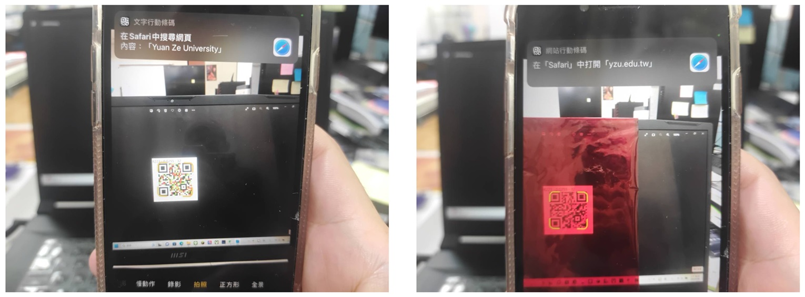

# Enhancing QR Code Interactivity through Color-Modulated Optical Filtering: A Dual-Message Approach

We present a two-level QR code system that enables the encoding of two distinct messages, discernible through standard QR code readers with and without a colored cellophane mask.

# Installation

The latest codes are tested on Windows 11, Python 3.12.4, and qrcode 7.4.2:

```shell
conda create -n ProjectNameYouWant anaconda
```

```shell
pip install qrcode
```

# Run

Use the following script the run the code

```shell
python color_masked_qr_code.py
```

# Read Messages

To fully read the QR code information, you need to prepare red cellophane. You can use a standard QR code reader. Without the cellophane, you can read the first message. By covering the QR code with the cellophane, you can read the second message. Please see the below example.

